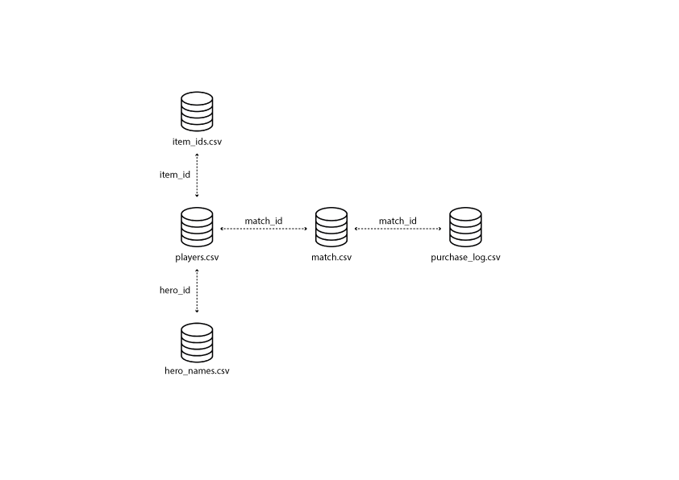

# A Tableau analysis of dota 2
#### Tableau visuations project created by Mikki Seidenschnur
##### Data obtained from [Kaggle](https://www.kaggle.com/devinanzelmo/dota-2-matches)

Ironhack data bootcamp in Berlin 27-06-2020

This repository contains:
* .gitignore
* README.md
* Link to tableau project

#### 1. What is DOTA 2?
The best person to answer that question is the famous "get started with DOTA 2" youtuber Purge. See [this](https://www.youtube.com/watch?v=9Szj-CloJiI) short video to become enlightened! ;)

#### 2. Where do we find those amazing visualisations that we've been promised?
The tableau project is available on following [link]()
The database overview is here. (There are several more tables in the original dataset, but some has been excluded since they were not necessary):

#### 3. Which is what, and what does it show?
1. How often does each team win
    * The map that the teams play on is NOT mirrored fully. In fact, some objectives only exist in one part of the map (Such as ROSHAN, let's hope you being paying attention to the terminology in the videos). Therefore, this visualisation shows that actually, the Radiant team has a winning advantage of 51.9% of all the 50000 games. Though this might make think as a DOTA 2 player: "Then I'll always chose the radiant side", it doesn't really matter, as teams placed by a pseudo random algorithm after they have been matched up with player of same level by the [ELO rating system](https://en.wikipedia.org/wiki/Elo_rating_system).
2. Which heroes are picked the most?
    * Heroes choices are widely recognized in the dota 2 community as one of the biggest impact factors of dota two. With each patch (hero update) usually the prefered and most picked heroes changes, since the dev-ops (Valve) has chosen to balance certain hero skills and abilities.
    During the patch analysed the 3 most picked heroes were [Windranger](https://www.youtube.com/watch?v=Lnk-SkHSB5M), [Shadow Fiend](https://www.youtube.com/watch?v=U9nKwvGtnaY), [Invoker](https://www.youtube.com/watch?v=oCcsA4P3dUM). 
    While Windranger and Invoker was chosen alot, the graph shows that it was relatively equally distribued throughout the matches analysed. However, it also shows that Shadow Fiend is chosen around 1000 times more by the Radiant team. This phenomenon can be confirmed by the following [guide](https://www.dotafire.com/dota-2/guide/updating-shadow-fiend-guide-nevermore-the-soultrain-stealer-221) that talks about this advantage in the given patch.
3. What is the duration of a DOTA 2 match?
    * When getting into DOTA 2, you need to know what kind of a time-machine it is! One moment you start a new game, and sometimes it will take up to 1 1/2 hours, if not more to finish the game. Even if you get an average game, that would mean that you have to stay for at least 40-45 minutes. 
    This is confirmed by the community [bloggers](https://www.gamespot.com/forums/pc-mac-linux-society-1000004/average-game-length-in-dota-2-vs-lol-29113042/) that on average estimate 40-50 minutes without data. The data shows to be normally distributed, if the 1 outlier of 16000 seconds is omitted from the data set, as it is just below the world record of the longest ever played games (usually these games are a result of player prolonging the game unecessarily)
4. Which items are the most bought?
    * Again, DOTA 2 is a very dynamic game. It shows that you can't just buy the same item every time and win. However, some items are considered a must. Like boots. Boots increase your movement speed, and make you do everything faster on the map. Therefore, it can be seen that "Power Treads", "Arcane Boots" and "Tranquil boots" are all in the top of the bubble-chart. In fact, this allows for another question to be asked - in all of the games, how many of them did each player buy boots?
5. How often does players buy boots
    * It can be seen that 103% of the players bought boots in the games. This means that in some games the players ended the game with having more than one pair of boots. This underlines the fact that boots is a necessary item that people ALWAYS want to by. 
    However, it does not mean that there are no players ending the game without boots - it just means that there more players ended the game with more than two boots than players ending the game with no boots.
6. Is there a correlation between the networth of the player and the total experience gain of the player?
    * When players kill minions or (creeps), they achieve two goals: 
        1. They gain experience points to get levels and gain new abilities
        2. They earn gold to be able to buy new items
    It would seem from this perspective that these should be related to each other. However, this is not a simple matter, since stashed gold will be lost upon death. Furthermore, the hero level tops out at level 30, meaning that no more experience can be gained after this point.
    The graph shows an automatically generated linear regression trendline that indicates a strong uphill correlation between the networth and the experience gained. This means that the higher the networth a player has, the higher the experience level they will have gained in the duration of the game. Therefore our linear regression seems a good estimate of for the future of experience level.

#### 4. Ideas of further work
* Communication - in the dataset, the chat data from all games have been included. It would be interesting to compare word usage and communication level to the games won. Does it make a difference if player communicate?
* Item timings - It would be extremely interesting to compare the teamfight outcomes to the items available in those team fights. 
* Recent data rather than old data - DOTA 2 has an open api for private users that can get all data when requested for it. It is available through [this link](https://docs.opendota.com/). It is a widely known dataset used by many applications, like [dotabuff](https://www.dotabuff.com/)

#### 5. Links and credits
* [Purge's description of DOTA 2 on youtube](https://www.youtube.com/user/PurgeGamers)
* [Kaggle data set, prepared by Devin Anzelmo](https://www.kaggle.com/devinanzelmo/dota-2-matches)